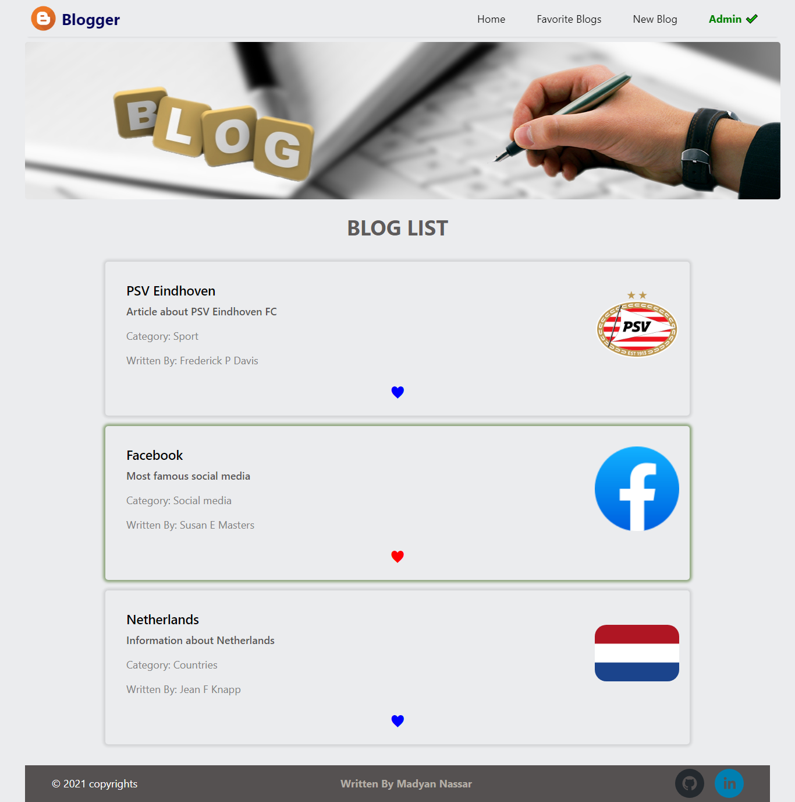

# React-Blog_App
## Info
This repository contains simple MERN blog app using Reactjs and Nodejs.

Online Deployment of this project is available at [Blog_MERN_app](https://blog-mern-client-4.herokuapp.com/).

# Pages
## Main page

## Blog detail page

## Create or Edit blog page

## Instalation
* Client:
- `git clone git@github.com:MadyanNassar/MERN-Blog_App.git`
- `cd MERN-Blog_App/client`
- `npm install`
- `npm start`
- Visit http://localhost:3000

* Server:
- `cd MERN-Blog_App/server`
- `npm install`
- `npm start server`

## Full Stack
- Front-end : ReactJS, react-router-dom, react-social-icons.
- Back-end : NodeJS, Express, cloudinary, multer, multer-storage-cloudinary.

## Admin privileges

In order to delete or edit any blog you need to get admin privileges by clicking on *Make me Admin* on the nav-bar.

(please note that this is not secure feature, but I build it just for test and fun)